# EJ Flutter App

A professional Flutter application built with **MVC architecture**, **Flutter Riverpod** for state management, and **GoRouter** for navigation. The project is organized for maintainability, scalability, and clean separation of concerns across controllers, models, services, and views.

---

## Table of Contents

- [Overview](#overview)
- [Architecture](#architecture)
- [Core Features](#core-features)
- [Tech Stack](#tech-stack)
- [Project Structure](#project-structure)
- [Screenshots](#screenshots)
- [Prerequisites](#prerequisites)
- [Getting Started](#getting-started)
- [Configuration](#configuration)
- [APK Download](#apk-download)
- [Usage](#usage)
- [State Management Example](#state-management-example)
- [Development Notes](#development-notes)
- [Future Improvements](#future-improvements)

---

## Overview

**EJ Flutter App** is a Flutter-based mobile application designed with a clear MVC structure and modern Flutter development practices. It uses **Riverpod** to manage application state in a predictable and maintainable way, while **GoRouter** provides declarative routing and navigation flow management.

The application structure supports scalable feature development, API-driven screens, local persistence, theming, reusable widgets, and a clean controller-based business logic layer. It is suitable for production-oriented Flutter development and future project expansion.

---

## Architecture

This project follows the **MVC (Model-View-Controller)** pattern:

- **Models** define the application's data structures and business entities.
- **Views** contain UI screens and reusable presentation widgets.
- **Controllers** manage business logic and state updates using Riverpod providers and notifiers.

### Architectural Highlights

- Clear separation between UI, business logic, and data
- Centralized route management with GoRouter
- Scalable folder structure for future feature growth
- Reusable utility, constant, and theme configuration
- Local persistence support with SharedPreferences
- Service layer support for API and storage operations

---

## Core Features

- MVC-based application structure
- Riverpod state management
- GoRouter navigation
- Authentication flow
- Protected screens and controlled navigation
- API integration support
- Local storage support
- Loading, error, and empty state handling
- Light and dark theme customization
- Reusable services and utility layers

---

## Tech Stack

### Framework & Language

- **Flutter**
- **Dart**

### State Management & Navigation

- `flutter_riverpod: ^3.2.0`
- `go_router: ^14.2.0`

### Networking & Storage

- `http: ^1.2.0`
- `shared_preferences: ^2.2.2`

---

## Project Structure

```text
lib/
├── controllers/        # Riverpod controllers / state notifiers
├── models/             # Data models and entities
├── routes/             # GoRouter route configuration
├── services/           # API services and local storage services
├── utils/              # App colors, constants, themes, helpers
└── views/              # Screens and reusable widgets
```

### Directory Roles

- **controllers/**: Handles business logic and state changes
- **models/**: Defines response models, request bodies, and app entities
- **routes/**: Configures routes, guards, and navigation logic
- **services/**: Contains API calls, persistence logic, and reusable service helpers
- **utils/**: Stores constants, themes, app colors, and shared helpers
- **views/**: Contains screens, widgets, and presentation-layer components

---

## Screenshots

> This README uses the screenshot paths exactly as shown in your project folder: `docs/screenshorts/`

<table>
  <tr>
    <td align="center"><strong>Resources Tab Overview</strong><br>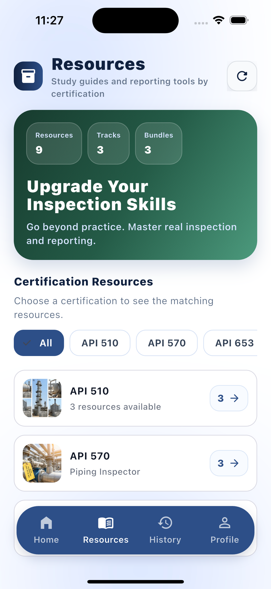</td>
    <td align="center"><strong>API 510 Resource Category List</strong><br>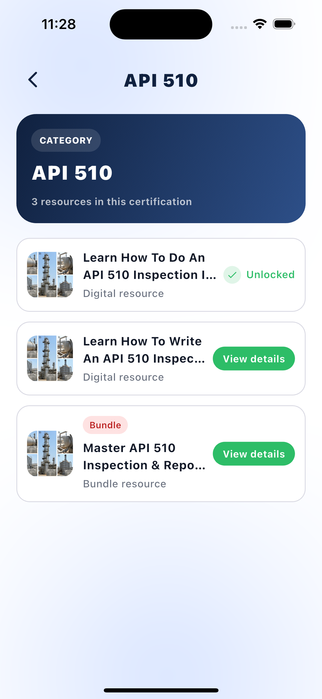</td>
  </tr>
  <tr>
    <td align="center"><strong>API 510 Resource Details Unlocked</strong><br>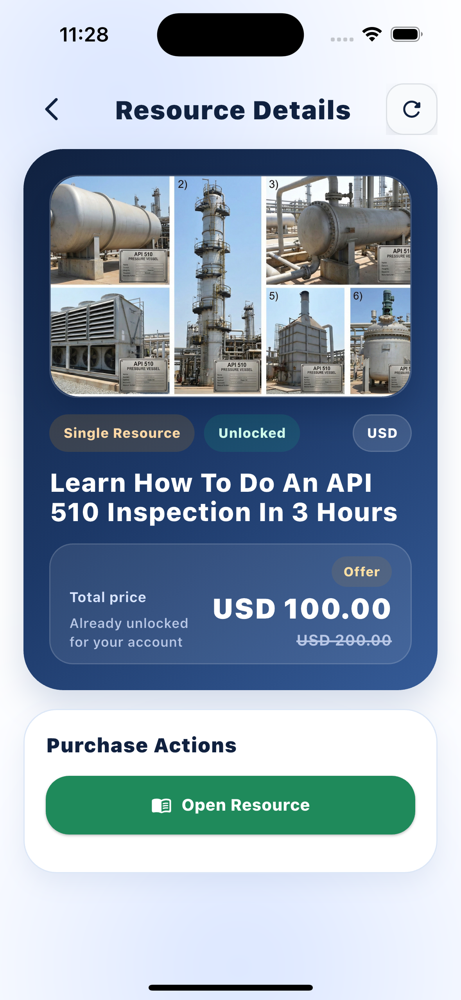</td>
    <td align="center"><strong>API 510 Resource Viewer Coming Soon</strong><br>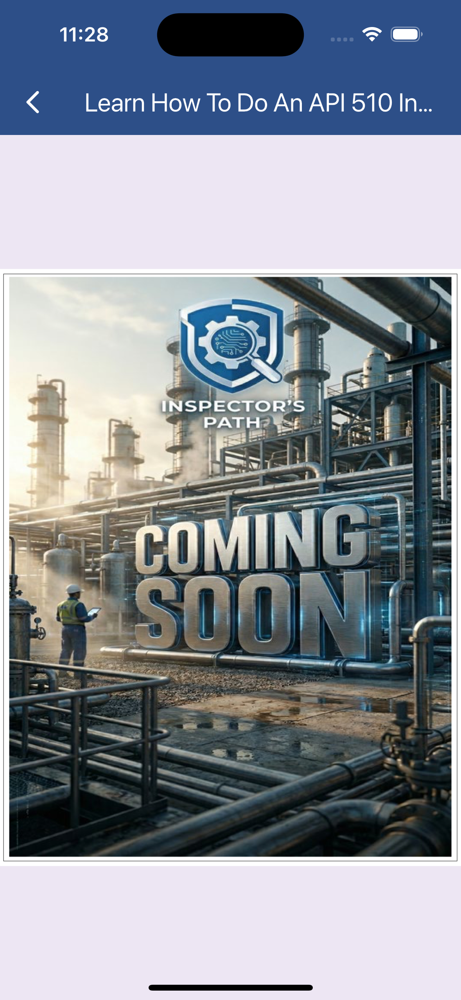</td>
  </tr>
  <tr>
    <td align="center"><strong>API 510 Resource Details Payment</strong><br>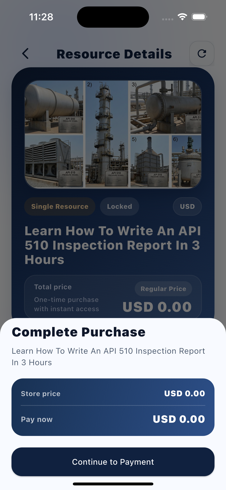</td>
    <td align="center"><strong>History Tab Overview</strong><br>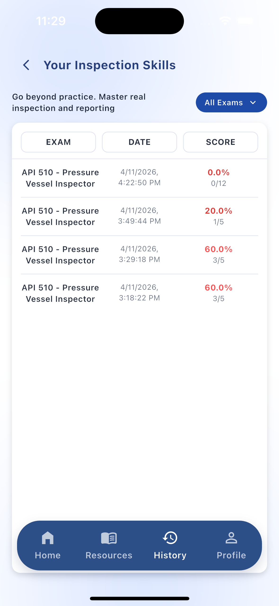</td>
  </tr>
  <tr>
    <td align="center"><strong>Login Screen</strong><br>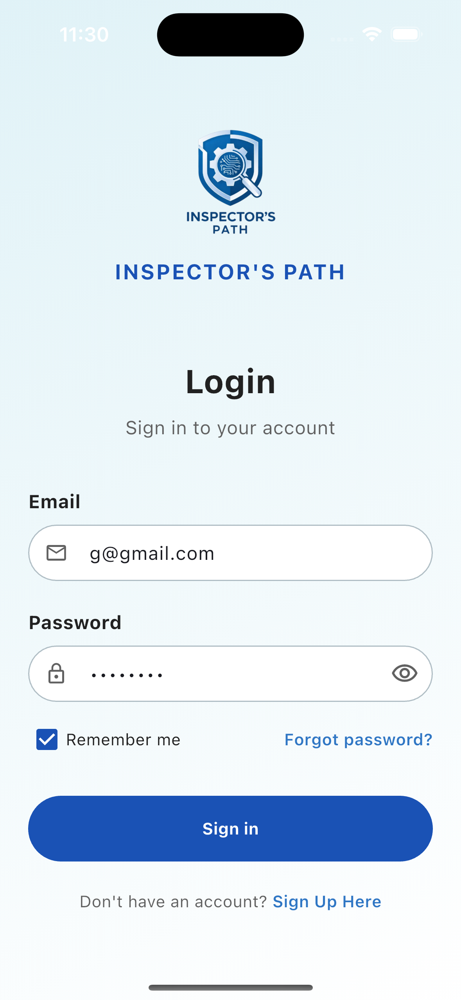</td>
    <td align="center"><strong>Exam Session Question 1</strong><br>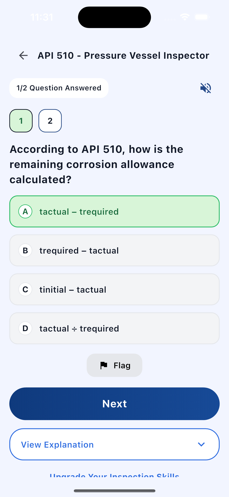</td>
  </tr>
  <tr>
    <td align="center"><strong>Exam Session Question 2 Explanation</strong><br>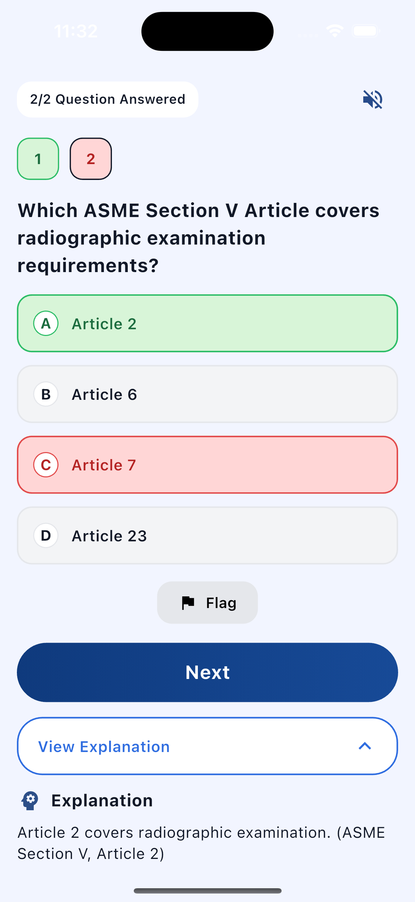</td>
    <td align="center"><strong>Exam Review Screen</strong><br>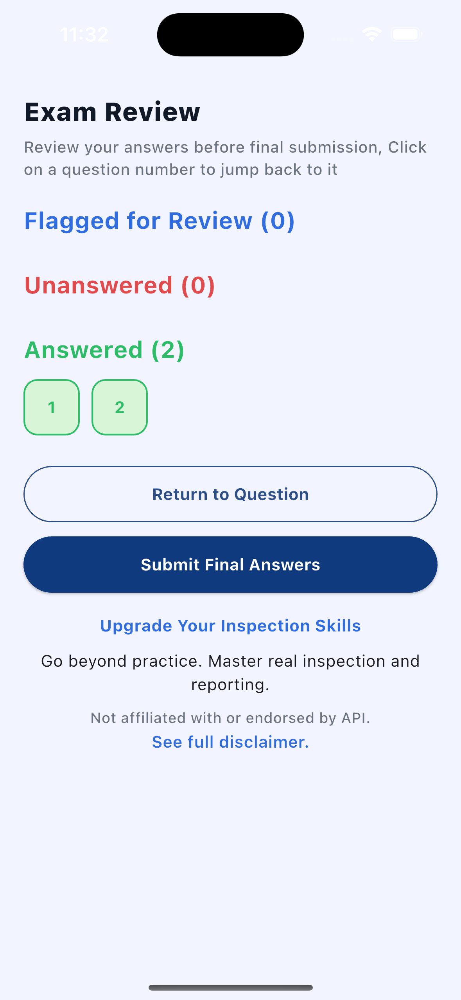</td>
  </tr>
  <tr>
    <td align="center"><strong>Quiz Complete Results</strong><br>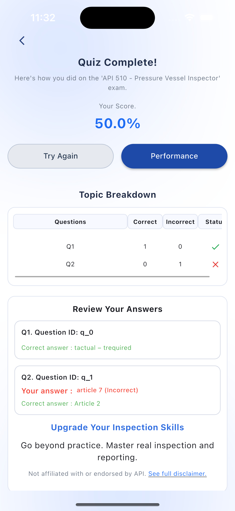</td>
    <td align="center"><strong>Performance Dashboard</strong><br>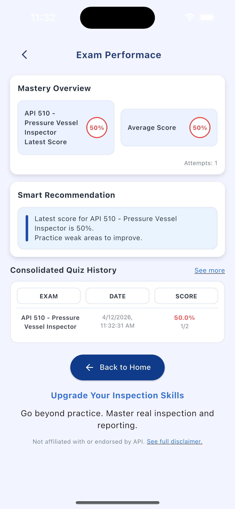</td>
  </tr>
  <tr>
    <td align="center"><strong>Home Screen Professional Plan</strong><br>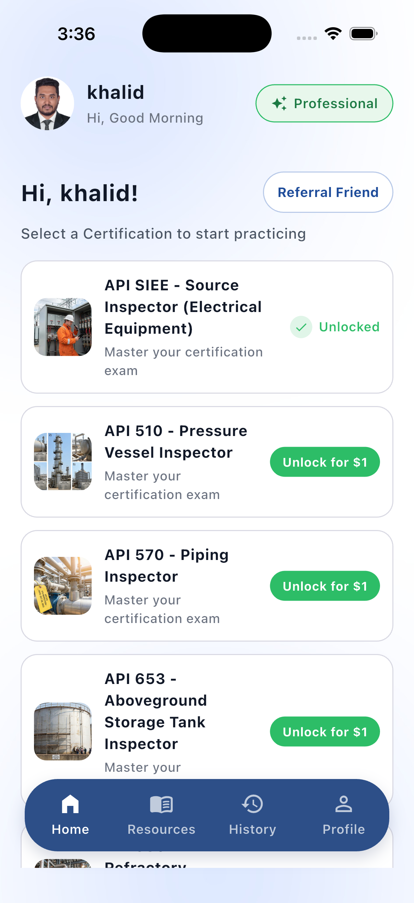</td>
    <td align="center"><strong>Unlock Exam Selection Dialog</strong><br>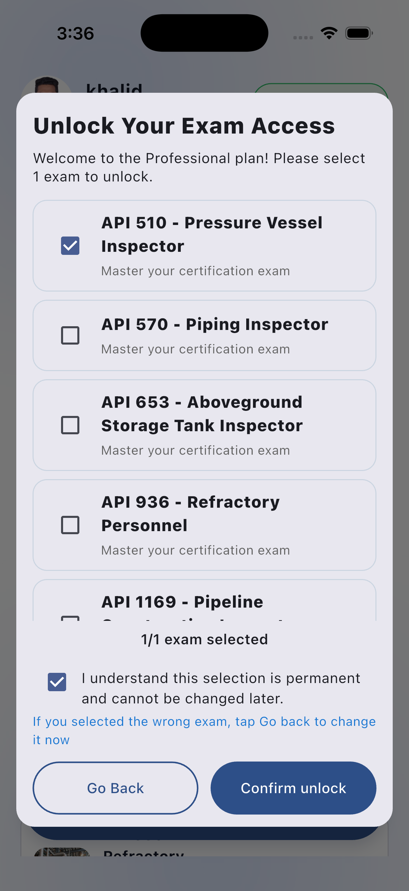</td>
  </tr>
  <tr>
    <td align="center"><strong>Add-on Resource Checkout Dialog</strong><br>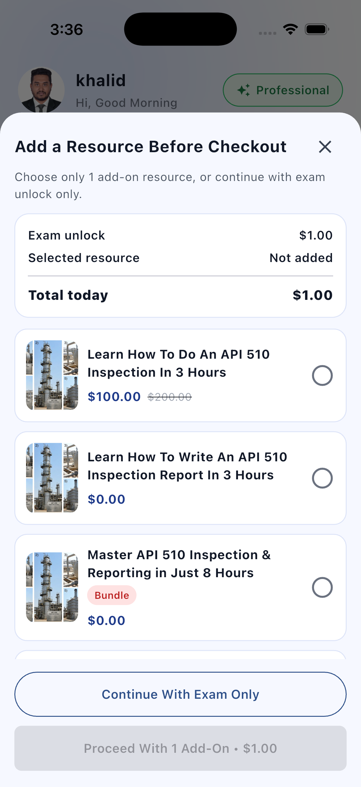</td>
    <td align="center"><strong>Profile Screen</strong><br>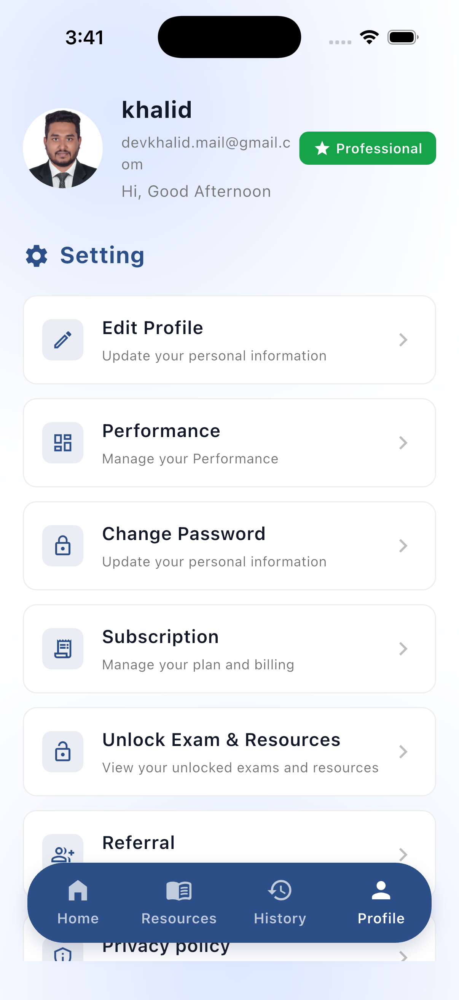</td>
  </tr>
</table>

---

## Prerequisites

Before running the application, make sure your environment is ready:

- Flutter SDK installed
- Dart SDK installed
- Android Studio or VS Code with Flutter extensions
- Android emulator, iOS simulator, or physical device
- API base URL configured in the constants file

Check your Flutter setup:

```bash
flutter doctor
```

---

## Getting Started

### 1. Install dependencies

```bash
flutter pub get
```

### 2. Configure the API base URL

Update the API configuration in:

```text
lib/utils/app_constants.dart
```

Example:

```dart
static const String baseUrl = 'https://your-api-url.com';
```

### 3. Add assets

Place project assets in the proper folders:

```text
assets/images/
assets/icons/
```

### 4. Run the app

```bash
flutter run
```

### 5. Build the app

```bash
# Android
flutter build apk --release

# iOS
flutter build ios --release
```

---

## Configuration

### API Base URL

Edit:

```text
lib/utils/app_constants.dart
```

### Custom Colors

Edit:

```text
lib/utils/app_colors.dart
```

### App Theme

Edit:

```text
lib/utils/app_theme.dart
```

These files allow you to customize branding, color palette, and light/dark theme behavior.

---

## APK Download

You can download and install the latest APK build from the link below:

- [Download APK](https://drive.google.com/file/d/1JJsvq3pIk6L81fwBCSxZxe-3rcVtQfut/view?usp=sharing)

> Ensure installation from unknown sources is enabled on your Android device if required.

---

## Usage

### Adding a New Screen

1. Create the screen under `lib/views/`
2. Add the route in `lib/routes/app_router.dart`
3. Connect the screen to a controller if state handling is required

### Adding a New Model

1. Create the model in `lib/models/`
2. Add `fromJson` and `toJson` methods for serialization
3. Use the model inside services and controllers as needed

### Adding a New Service

1. Create a service in `lib/services/`
2. Centralize API or storage logic there
3. Call the service through your controller/provider layer

---

## State Management Example

```dart
// Watch state
final authState = ref.watch(authControllerProvider);

// Read controller
ref.read(authControllerProvider.notifier).login(email, password);
```

This pattern keeps business logic outside the UI layer and improves maintainability.

---

## Development Notes

- Keep controllers focused on state and business rules
- Keep views free from heavy logic
- Centralize API and storage logic inside services
- Reuse theme and constants from the `utils/` directory
- Organize new features without breaking the MVC structure
- Add loading, error, and empty states for all API-driven screens

---

## Included Screens

The project currently includes flows and screens such as:

- Splash screen
- Login screen
- Register screen
- Home screen
- Profile screen
- Resource browsing screens
- Exam session screens
- Review and result screens
- Performance dashboard
- Purchase and unlock dialogs
- History view

---

## Future Improvements

- Expand protected route handling
- Add more API-driven modules
- Improve offline persistence strategy
- Add unit and widget testing
- Extend reusable widget library
- Introduce feature-specific folders if the project grows further

---

## Flutter Resources

- [Flutter Documentation](https://docs.flutter.dev/)
- [Dart Language Tour](https://dart.dev/guides/language/language-tour)
- [Riverpod Documentation](https://riverpod.dev/)
- [GoRouter Documentation](https://pub.dev/packages/go_router)
